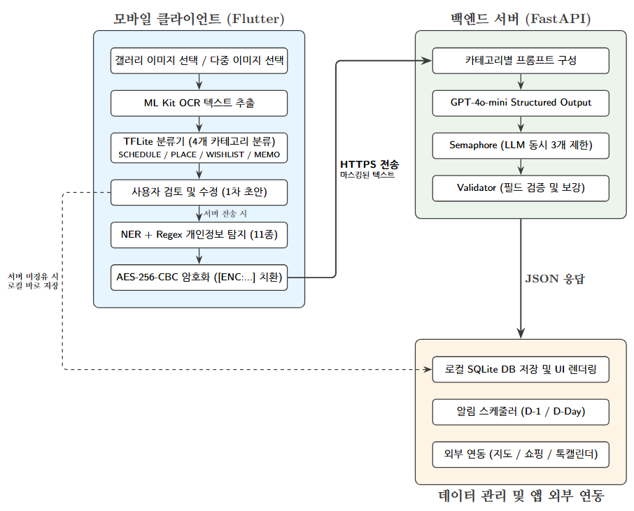

# 🎓 35조 스스슥 — Sortie (솔티)

> **OCR 및 온디바이스 멀티모달 분류 모델을 활용한 맞춤형 스크린샷 아카이빙 시스템**

| 항목 | 내용 |
|------|------|
| **팀명** | 스스슥 (35조) |
| **프로젝트명** | Sortie (솔티) |
| **지도교수** | 탁성우 교수님 |
| **개발 기간** | 2026.03 ~ 2026.09 |

---

### 1. 프로젝트 배경

#### 1.1. 국내외 시장 현황 및 문제점

스마트폰 사용자의 정보 수집 방식은 빠르게 변화하고 있다. 메모 앱을 따로 여는 대신, 웹페이지·메신저·SNS에서 발견한 정보를 **스크린샷으로 즉각 캡처**하는 것이 가장 보편적인 기록 수단이 되었다. 그러나 이렇게 저장된 이미지들은 텍스트가 아닌 **픽셀 데이터**이므로 검색·편집·활용이 불가능한 채 갤러리에 쌓여간다. 이를 **다크 데이터(Dark Data)** 문제라 한다.

이를 해결하기 위해 다양한 서비스가 등장하였으나, 각각 뚜렷한 한계를 지닌다.

| 유형 | 대표 서비스 | 장점 | 한계 |
|------|-------------|------|------|
| **갤러리 정리 앱** | Slidebox | 폴더 기반 분류 | 이미지 내부 의미 추출 불가, 수동 정리에 의존 |
| **클라우드 AI 보관함** | mymind | 강력한 분류·검색 | 이미지 원본을 서버로 전송 → **개인정보 유출 위험** |
| **완전 온디바이스 AI** | Pixel Screenshots | 로컬 처리로 프라이버시 보호 | 기기 연산 한계로 복잡한 정보 구조화에 취약, 클라우드 폴백 |

즉, **개인정보 보호**와 **높은 정보 추출 정확도**를 동시에 만족하는 솔루션은 시장에 부재하다.

#### 1.2. 필요성과 기대효과

스크린샷 안에는 일정, 맛집, 쇼핑 상품, 레시피 등 다양한 정보가 뒤섞여 있다. 사용자가 이 정보를 실제로 활용하려면 ① 이미지를 다시 찾고 ② 내용을 읽고 ③ 다른 앱(캘린더, 지도, 쇼핑몰)에 직접 입력해야 하는 **인지적·물리적 마찰(Friction)**이 발생한다.

Sortie는 이러한 마찰을 제거하여 다음과 같은 기대효과를 제공한다.

- **시간 절약**: 스크린샷 한 장에서 정보를 자동 추출·구조화하여 수동 입력 과정을 제거
- **프라이버시 보호**: 민감정보를 기기 내부에서 먼저 암호화한 후 서버로 전송하는 **Privacy-by-Design** 아키텍처
- **즉시 실행 가능한 정보**: 추출된 데이터가 캘린더 등록·지도 검색·최저가 탐색 등 **외부 서비스와 즉시 연결**
- **스토리지 최적화**: 텍스트 추출 완료 후 불필요한 원본 이미지를 정리하여 기기 용량 확보

---

### 2. 개발 목표

#### 2.1. 목표 및 세부 내용

Sortie의 목표는 스크린샷을 단순한 이미지 보관이 아닌 **"실행 가능한 지식 베이스(Actionable Knowledge Base)"**로 전환하는 것이다.

**핵심 파이프라인**: `이미지 → OCR → 온디바이스 분류 → 민감정보 암호화 → (선택적) 서버 LLM 구조화 → 보관함 저장 → 외부 서비스 연동`

**주요 기능:**

| # | 기능 | 설명 |
|---|------|------|
| 1 | **온디바이스 OCR + 분류** | Google ML Kit으로 텍스트 추출 후, TFLite 모델이 1ms 이내에 4개 카테고리(일정/장소/위시/메모)로 분류 |
| 2 | **이중 개인정보 보호** | NER 모델(이름·전화번호) + Regex(주민번호·카드번호 등 11종) 탐지 → AES-256-CBC 암호화 후 `[ENC:...]` 토큰으로 치환 |
| 3 | **LLM 기반 구조화** | 마스킹된 텍스트를 GPT-4o-mini에 전달, 카테고리별 맞춤 프롬프트로 구조화된 JSON 추출 (Structured Output) |
| 4 | **Zero-Friction 액션** | 추출된 정보를 카카오맵 길찾기, 네이버 쇼핑 최저가, 카카오 톡캘린더 등록 등 외부 서비스와 원클릭 연결 |
| 5 | **다중 이미지 일괄 분석** | 대기실에 여러 장을 올려 일괄 AI 분석 → 카테고리별 보관함에 자동 분류 저장 |
| 6 | **알림 스케줄러** | 만료 임박 기프티콘·일정을 자동 감지하여 D-1/D-Day 알림 생성 |

#### 2.2. 기존 서비스 대비 차별성

| 비교 항목 | Slidebox | mymind | Pixel Screenshots | **Sortie** |
|-----------|----------|--------|-------------------|------------|
| 이미지 내 정보 추출 | ✗ | ○ (서버) | ○ (로컬) | **◎ (하이브리드)** |
| 카테고리 자동 분류 | ✗ | ○ | ○ | **◎ (4종 + 세부 유형)** |
| 개인정보 보호 | – | ✗ (서버 전송) | ○ (로컬) | **◎ (로컬 암호화 + 서버)** |
| 외부 서비스 연동 | ✗ | ✗ | △ | **◎ (캘린더·지도·쇼핑)** |
| 온디바이스 처리 속도 | – | – | △ | **◎ (분류 1ms 이내)** |
| 사용자 검토·수정 | ✗ | ✗ | △ | **◎ (AI 초안 + 수동 보정)** |

Sortie의 핵심 차별점은 **"온디바이스의 속도와 안전성"과 "클라우드 LLM의 높은 지능"을 결합한 하이브리드 아키텍처**를 채택하여, 개인정보가 평문 상태로 서버에 전달되지 않으면서도 높은 수준의 정보 구조화를 달성한다는 점이다.

#### 2.3. 사회적 가치 도입 계획

- **프라이버시 보호**: 개인정보를 기기 내부에서 선제적으로 암호화하는 Privacy-by-Design 원칙을 적용하여, 사용자의 민감한 스크린샷(신분증, 금융정보 등)이 외부로 노출되지 않도록 설계하였다.
- **정보 접근성 향상**: 이미지에 묻혀 있는 비정형 정보를 구조화하여 검색·활용 가능하게 함으로써, 디지털 정보 관리에 어려움을 겪는 사용자에게도 편의를 제공한다.
- **스토리지 낭비 방지**: 텍스트 구조화가 완료된 이미지를 자동으로 정리하여 기기 저장 공간을 확보하고, 불필요한 데이터 축적에 의한 에너지 낭비를 줄인다.

---

### 3. 시스템 설계

#### 3.1. 시스템 구성도



#### 3.2. 사용 기술

##### Frontend (Mobile)

| 기술 | 버전 | 용도 |
|------|------|------|
| Flutter (Dart) | SDK ^3.12.2 | 크로스플랫폼 모바일 앱 |
| google_mlkit_text_recognition | ^0.15.1 | 온디바이스 OCR (한글/영문) |
| tflite_flutter | ^0.12.1 | TFLite 모델 추론 (분류기 + NER) |
| flutter_riverpod | ^3.3.2 | 상태 관리 |
| sqflite | ^2.3.0 | 로컬 SQLite DB |
| encrypt | ^5.0.3 | AES-256-CBC 암호화 |
| flutter_secure_storage | ^9.2.2 | 암호화 키 보안 저장 |
| kakao_flutter_sdk | ^1.9.1 | 카카오맵·톡캘린더 연동 |
| firebase_messaging | ^16.5.0 | FCM 푸시 알림 |
| dio | ^5.10.0 | HTTP 클라이언트 (서버 통신) |

##### Backend (Server)

| 기술 | 버전 | 용도 |
|------|------|------|
| Python | 3.12 | 서버 런타임 |
| FastAPI | 0.139.0 | REST API 서버 |
| OpenAI API (GPT-4o-mini) | — | LLM 기반 정보 구조화 |
| Uvicorn | 0.49.0 | ASGI 서버 |
| SQLite | — | 분석 결과 캐싱 및 알림 관리 |
| Pydantic | 2.13 | 요청/응답 스키마 검증 |
| Tenacity | 9.1 | LLM 호출 Exponential Backoff 재시도 |
| firebase_admin | 7.5.0 | 푸시 알림 발송 |

##### On-Device AI Models

| 모델 | 형식 | 크기 | 용도 |
|------|------|------|------|
| 텍스트 분류기 | TFLite | 130KB | 4-class 대분류 (Character N-gram + TF-IDF → Linear) |
| NER 모델 | TFLite | 56MB | 이름·전화번호 문맥 기반 탐지 (WordPiece + BIO 태깅) |

---

### 4. 개발 결과

#### 4.1. 전체 시스템 흐름도

```
사용자: 갤러리에서 이미지 선택 (1장 또는 다중)
         ↓
[온디바이스] ML Kit OCR → 텍스트 추출
         ↓
[온디바이스] 상태바 노이즈 제거 (시간/통신사 등)
         ↓
[온디바이스] TFLite 분류기 → 4개 카테고리 중 하나로 분류 (평균 0.135ms)
         ↓
[화면] 사용자에게 1차 초안 제시 → 카테고리·내용 검토/수정 가능
         ↓
    ┌─── 로컬 저장 선택 ──→ 로컬 SQLite에 바로 저장
    │
    └─── 서버 분석 선택 ──→ [온디바이스] NER + Regex 민감정보 탐지
                                    ↓
                           [온디바이스] AES-256-CBC 암호화 → [ENC:...] 토큰 치환
                                    ↓ HTTPS
                           [서버] 카테고리별 프롬프트 + LLM 호출 (GPT-4o-mini)
                                    ↓
                           [서버] Validator: 필수 필드 검증 + 날짜·가격 정규화
                                    ↓ JSON 응답
                           [앱] 로컬 DB 저장 + 보관함 UI 카드 렌더링
                                    ↓
                           [앱] 외부 서비스 연동 (카카오맵 / 네이버쇼핑 / 톡캘린더)
```

#### 4.2. 기능 설명 및 주요 기능 명세서

##### 4.2.1. 카테고리별 정보 구조화

| 카테고리 | 추출 필드 | 외부 연동 |
|----------|-----------|-----------|
| 📅 **SCHEDULE** | title, start_at, end_at, expires_at, start_time, end_time, exchange_place, participants, recurrence, sub_type (GIFTICON/TICKET/SUBSCRIPTION 등) | 카카오 톡캘린더 등록, iCalendar 다운로드, D-Day 알림 |
| 📍 **PLACE** | name, address, region, category, phone, rating, hours, description (다중 장소 시 개별 분리) | 카카오맵 원클릭 검색 |
| 💛 **WISHLIST** | product_name, brand, price_amount, price_currency, url, description (다중 상품 시 개별 분리) | 네이버 쇼핑 최저가 검색 |
| 📝 **MEMO** | title, body, checklist, tags | 텍스트 복사 및 공유 |

##### 4.2.2. 개인정보 보호 파이프라인

1단계(NER): TFLite NER 모델이 WordPiece 토큰화 후 BIO 태깅으로 사람 이름(PER)과 전화번호(PHONE) 탐지  
2단계(Regex): 주민등록번호, 카드번호, CVC/CVV, 쿠폰번호, 계좌번호, 예약번호, 여권번호, MRZ, 운전면허번호, 신분증 주소·날짜 등 11종 패턴 탐지  
3단계(암호화): 탐지된 문자열을 AES-256-CBC로 암호화하여 `[ENC:Base64]` 토큰으로 치환 후 서버 전송

##### 4.2.3. 성능 평가 결과 (200개 샘플 기준)

**처리 시간 비교:**

| 카테고리 | Regex (온디바이스) | LLM (서버) | 샘플 수 |
|----------|-------------------|-----------|---------|
| SCHEDULE | 0.199 ms | 1.317 s | 50 |
| PLACE | 0.123 ms | 0.889 s | 50 |
| WISHLIST | 0.135 ms | 0.784 s | 50 |
| MEMO | 0.083 ms | 1.230 s | 50 |
| **전체 평균** | **0.135 ms** | **1.06 s** | **200** |

→ 온디바이스 분류는 평균 0.135ms로 즉각 반응하며, LLM 구조화는 평균 1.06초로 심층 정보 추출을 수행한다.

#### 4.3. 디렉토리 구조

```
soseang_app/
│
├── app/                             # 🔵 백엔드 서버 (FastAPI)
│   ├── main.py                      #   FastAPI 앱 인스턴스, 라우터 등록, DB 초기화
│   ├── config.py                    #   환경 설정 (API 키, 모델명, DB 경로)
│   ├── llm_client.py                #   OpenAI API 호출 래퍼 (재시도 + 폴백)
│   ├── concurrency.py               #   Semaphore 기반 LLM 동시 호출 제한 (최대 3)
│   ├── prompts.py                   #   카테고리별 LLM 시스템 프롬프트
│   ├── schemas.py                   #   Pydantic 요청/응답 스키마 정의
│   ├── validator.py                 #   LLM 응답 필드 검증 및 보강
│   ├── database.py                  #   SQLite CRUD (screenshots, 알림, 토큰)
│   ├── scheduler.py                 #   알림 스케줄러 (만료 임박 일정 자동 감지)
│   ├── calendar.py                  #   iCalendar (.ics) 파일 생성
│   └── routers/
│       ├── analyze.py               #   /api/analyze — 단건·배치·비동기 분석 API
│       ├── results.py               #   /api/results — 결과 조회·수정·검색·ICS 다운로드
│       └── notifications.py         #   /api/notifications — 기기 토큰 등록·알림 조회
│
├── lib/                             # 🟢 모바일 클라이언트 (Flutter / Dart)
│   ├── main.dart                    #   앱 전체 UI·상태관리·OCR·분류·통신 통합
│   ├── firebase_options.dart        #   Firebase 프로젝트 설정
│   ├── core/
│   │   ├── ml/
│   │   │   └── on_device_text_classifier.dart  # TFLite 분류기 (N-gram + TF-IDF)
│   │   ├── storage/
│   │   │   ├── app_storage.dart                # 앱 로컬 저장 디렉토리 초기화
│   │   │   └── database_helper.dart            # 클라이언트 SQLite DB 관리
│   │   └── utils/
│   │       ├── masking_helper.dart             # NER + Regex 민감정보 탐지 (11종)
│   │       ├── ner_classifier.dart             # TFLite NER 모델 추론
│   │       ├── ner_tokenizer.dart              # WordPiece 토크나이저
│   │       └── crypto_helper.dart              # AES-256-CBC 암호화/복호화
│   ├── screens/
│   │   └── notifications_screen.dart           # 알림 탭 UI
│   └── services/
│       ├── fcm_service.dart                    # FCM 푸시 알림 초기화·핸들링
│       └── kakao_calendar_service.dart         # 카카오 톡캘린더 OAuth + 일정 등록
│
├── ai_training/                     # 🟡 서버 분류 모델 학습
│   ├── train.py                     #   멀티모달 분류 모델 학습 스크립트
│   ├── build_dataset.py             #   학습용 데이터셋 빌드
│   ├── inference.py                 #   모델 추론 테스트
│   ├── dataset.csv                  #   학습 데이터
│   └── multimodal_model.pth         #   학습 완료 모델 가중치
│
├── on_device_ai/                    # 🟠 온디바이스 AI 모델 학습
│   ├── src/
│   │   ├── train.py                 #   경량 분류기 학습 → TFLite 변환
│   │   ├── preprocess.py            #   텍스트 전처리 파이프라인
│   │   └── build_dataset_from_images.py  # 이미지 기반 데이터셋 구축
│   └── data/                        #   학습 데이터
│
├── evaluation/                      # 🟣 성능 평가
│   ├── evaluate_extraction.py       #   온디바이스 vs LLM 추출 정확도 평가
│   ├── test_ondevice_vs_llm.py      #   비교 테스트 (200개 샘플)
│   └── evaluation_results_final.json #  최종 평가 결과
│
├── assets/                          # 📦 앱 번들 에셋
│   ├── classifier_demo.tflite       #   온디바이스 분류 모델 (130KB)
│   ├── ner_model.tflite             #   온디바이스 NER 모델 (56MB)
│   ├── vocab.json / idf.json        #   분류기 어휘 사전 + IDF 가중치
│   ├── vocab.txt                    #   NER WordPiece 토크나이저 어휘
│   └── *_label_map.json             #   분류기 / NER 라벨 매핑
│
├── scripts/                         # 🔧 유틸리티 스크립트
│   ├── cleanup.py                   #   코드 정리 (디버그 print·이모지 제거)
│   └── fix_*.py                     #   Gradle/Manifest 설정 패치
│
├── run.py                           # 서버 실행 진입점 (uvicorn)
├── requirements.txt                 # Python 의존성
├── pubspec.yaml                     # Flutter 의존성 및 에셋 등록
├── sss-app.service                  # systemd 서비스 파일 (배포 서버용)
├── .env.example                     # 환경변수 템플릿
└── firebase.json / firebase-key.json # Firebase 설정
```

#### 4.4. 산업체 멘토링 의견 및 반영 사항

| # | 멘토 피드백 | 반영 내용 |
|---|------------|-----------|
| 1 | 기프티콘 OCR 텍스트를 3줄로 축약하면 정보 손실이 발생할 수 있음 | 원본 OCR 텍스트 전체를 보존하여 LLM 입력에 활용하도록 개선 |
| 2 | 온디바이스 분류 모델의 정확도가 특정 카테고리에서 낮을 수 있음 | Character N-gram + TF-IDF 기반 특징 추출로 OCR 오류에 강인한 분류기 설계 |
| 3 | LLM 응답의 필드 누락 및 형식 불일치 문제 | Pydantic Structured Output 도입 + Validator 계층에서 카테고리별 필수 필드 검증 및 자동 보강 |
| 4 | 동시 다수 요청 시 API Rate Limit 발생 가능 | Semaphore(최대 3) + Tenacity Exponential Backoff 재시도(최대 3회) 적용 |

---

### 5. 설치 및 실행 방법

#### 5.1. 설치 절차 및 실행 방법

##### 사전 요구사항

- Flutter SDK (Stable, ^3.12.2)
- Android Studio (Android SDK, SDK Command-line Tools 포함)
- Python 3.12+
- Git

##### ① 저장소 클론

```bash
git clone https://github.com/pnucse-capstone2025/Capstone-2025-team-35.git
cd Capstone-2025-team-35
```

##### ② 백엔드 서버 실행

```bash
# 가상환경 생성 및 활성화
python -m venv venv
venv\Scripts\activate          # Windows
# source venv/bin/activate     # macOS/Linux

# 의존성 설치
pip install -r requirements.txt

# 환경변수 설정
cp .env.example .env
# .env 파일에 OPENAI_API_KEY 기입

# 서버 실행 (기본 포트: 8000)
python run.py
```

서버가 정상 실행되면 `http://0.0.0.0:8000`에서 접근 가능하다.

##### ③ 모바일 앱 실행

```bash
# Flutter 환경 점검
flutter doctor

# 의존성 설치
flutter pub get

# 연결된 기기 확인
flutter devices

# 앱 실행
flutter run -d <디바이스_ID>
```

> **참고:** 최초 빌드 시 Google 온디바이스 NDK 및 한글 OCR 모델을 다운로드하므로 수 분이 소요될 수 있다.

##### ④ 배포 서버 실행 (Ubuntu)

```bash
# systemd 서비스 등록
sudo cp sss-app.service /etc/systemd/system/
sudo systemctl daemon-reload
sudo systemctl enable sss-app
sudo systemctl start sss-app
```

#### 5.2. 오류 발생 시 해결 방법

| 증상 | 원인 | 해결 방법 |
|------|------|-----------|
| `flutter doctor`에서 `[X]` 표시 | Android SDK 라이선스 미동의 | `flutter doctor --android-licenses` 실행 |
| 앱 빌드 시 `minSdk` 오류 | ML Kit이 요구하는 최소 SDK 버전 미충족 | `android/app/build.gradle.kts`에서 `minSdk = 21` 이상 설정 |
| 서버 실행 시 `OPENAI_API_KEY` 오류 | `.env` 파일 미설정 | `.env.example`을 복사하여 API 키 기입 |
| LLM 호출 타임아웃 | 네트워크 불안정 또는 Rate Limit | 자동 재시도(최대 3회)가 적용되어 있으며, 최종 실패 시 MEMO 폴백 반환 |
| NER 모델 로드 실패 | `assets/ner_model.tflite` 미포함 | `pubspec.yaml`의 assets 섹션에 파일 등록 확인 후 `flutter pub get` 재실행 |

---

### 6. 소개 자료 및 시연 영상

#### 6.1. 프로젝트 소개 자료

[발표자료](docs/03.발표자료/발표자료.pptx)

#### 6.2. 시연 영상

[](https://youtu.be/LR4LnQ8bnfQ?si=Id3y_k6-qTkCOfds)

---

### 7. 팀 구성

#### 7.1. 팀원별 소개 및 역할 분담

| 이름 | 학번 | 역할 | 담당 내용 |
|------|------|------|-----------|
| **공다은** | 202255506 | 모바일 앱 개발 및 UI/UX | Flutter 기반 클라이언트 UI/UX 구현, 카카오톡 소셜 로그인 및 카테고리별 외부 서비스 연동(위시리스트 상품 최저가 링크, 장소 카카오맵 길찾기 링크, 톡캘린더 연동), 다중 이미지 일괄 분석 클라이언트 로직 개발 |
| **오예린** | 202255573 | 백엔드 개발 및 프롬프트 엔지니어링 | FastAPI 기반 비동기 백엔드 설계 및 세마포어 동시성 제어 기반 일괄 분석 API 구현, GPT-4o-mini 구조화 출력 설계 및 프롬프트 최적화, 카테고리별 데이터 검증(Validator) 엔진 및 알림 스케줄러 개발 |
| **정채윤** | 202255614 | 온디바이스 AI 및 개인정보 보호 Architecture / 시스템 통합 | 온디바이스 AI 분류 모델 데이터셋 구축·재학습 및 TFLite 경량화 변환, Privacy-by-Design 기반 이중 개인정보 보호 체계(NER + 11종 Regex 탐지 및 AES-256-CBC 암호화 엔진) 설계 및 구현, 백엔드-클라이언트 동적 데이터 연동 및 시스템 통합 테스트 |

**지도교수:** 탁성우 교수님

---

### 8. 참고 문헌 및 출처

1. H. Kim, J. Park, and S. Lee, "Privacy-Preserving On-Device LLM Processing for Mobile Applications," *Proceedings of the ACM MobiSys*, 2024.
2. H. Jeong et al., "Dynamic Batch Optimization for On-device LLM Model Responsiveness," *Journal of KIISE*, vol. 52, no. 2, pp. 150-158, 2025.
3. S. Garg, Harichandana, and S. Kumar, "On-Device Document Classification using multimodal features," *Proceedings of the 8th ACM IKDD CODS and 26th COMAD*, pp. 1-5, 2021.
4. B. Chen, Y. Chen, X. Jiang, et al., "Unleashing the Potential of Prompt Engineering in Large Language Models: A Comprehensive Review," arXiv preprint arXiv:2310.14735, 2023.
5. G. Shim, S. Hong, and H. Lim, "REVISE: A Framework for Revising OCRed text in Practical Information Systems with Data Contamination Strategy," arXiv preprint arXiv:2604.08115, 2026.
6. Google, "ML Kit Text Recognition Documentation," Google Developers. https://developers.google.com/ml-kit/vision/text-recognition
7. Flutter, "Flutter Documentation," https://docs.flutter.dev/
8. Pydantic, "Pydantic Documentation," https://docs.pydantic.dev/
9. OpenAI, "OpenAI API Documentation," https://platform.openai.com/docs/
10. SQLite, "SQLite Documentation," https://www.sqlite.org/docs.html
