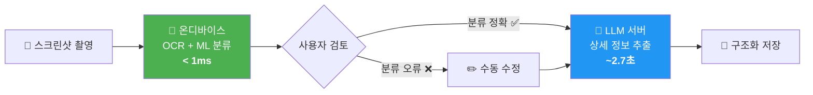

# 온디바이스 vs LLM 정보 추출 품질·성능 비교 분석

> 캡스톤 중간보고서 전문가 자문 피드백 **2번 항목** 대응 자료

## 실험 개요

| 항목 | 내용 |
|------|------|
| **목적** | 온디바이스(로컬) 추출과 LLM(서버) 추출의 정보 구조화 품질 차이를 정량적으로 비교 |
| **비교군 1** | 온디바이스: OCR 텍스트에서 정규식(Regex)만으로 직접 파싱 |
| **비교군 2** | LLM: GPT-4o-mini 기반 2단계 파이프라인 (분류 → 타입별 추출) |
| **테스트 셋** | 15개 (SCHEDULE 6건, PLACE 4건, WISHLIST 3건, MEMO 2건) |
| **측정 항목** | 필드별 추출 정확도 (정답 대비 일치율) + 처리 소요 시간 |

---

## 1. 전체 결과 요약

| 방식 | 정확 필드 | 전체 필드 | **추출 정확도** | **총 처리 시간** | **건당 평균 시간** |
|------|--------:|--------:|:----------:|:-----------:|:------------:|
| 온디바이스 (Regex) | 17 | 44 | **38.6%** | ≈ 0 ms | **< 1 ms** |
| LLM (GPT-4o-mini) | 37 | 44 | **84.1%** | 39,924 ms | **≈ 2,662 ms** |

> [!IMPORTANT]
> LLM은 온디바이스 대비 **추출 정확도가 2.2배(+45.5%p) 높지만**, 처리 시간은 건당 약 **2.7초** 소요됩니다.
> 이는 우리 앱의 **2단계 하이브리드 구조**(빠른 로컬 분류 + 선택적 서버 분석)가 합리적인 설계임을 뒷받침합니다.

---

## 2. 항목별 상세 결과

| No | 테스트 데이터 | 카테고리 | 온디바이스 정확도 | LLM 정확도 | LLM 소요 시간 |
|:--:|:-----------|:------:|:-----------:|:--------:|:---------:|
| 1 | 스타벅스 기프티콘 | SCHEDULE | 2/3 (66.7%) | **3/3 (100%)** | 3,688ms |
| 2 | 카카오톡 약속 대화 | SCHEDULE | 1/4 (25.0%) | **3/4 (75.0%)** | 2,042ms |
| 3 | 넷플릭스 구독 결제 | SCHEDULE | 2/3 (66.7%) | **3/3 (100%)** | 1,750ms |
| 4 | KTX 기차표 | SCHEDULE | **3/4 (75.0%)** | 3/4 (75.0%) | 2,548ms |
| 5 | 시험 마감일 | SCHEDULE | 1/3 (33.3%) | **3/3 (100%)** | 2,138ms |
| 6 | 맛집 정보 | PLACE | 1/3 (33.3%) | **2/3 (66.7%)** | 2,875ms |
| 7 | 카페 추천 대화 | PLACE | 1/4 (25.0%) | **3/4 (75.0%)** | 2,697ms |
| 8 | 네이버 지도 스크린샷 | PLACE | 1/3 (33.3%) | **3/3 (100%)** | 2,701ms |
| 9 | 쿠팡 상품 페이지 | WISHLIST | 1/3 (33.3%) | **3/3 (100%)** | 2,855ms |
| 10 | 무신사 장바구니 | WISHLIST | 0/2 (0.0%) | **2/2 (100%)** | 2,314ms |
| 11 | 요리 레시피 | MEMO | 1/2 (50.0%) | 1/2 (50.0%) | 3,996ms |
| 12 | 할 일 체크리스트 | MEMO | 1/2 (50.0%) | 1/2 (50.0%) | 2,684ms |
| 13 | 배달 주문 확인 | SCHEDULE | 1/3 (33.3%) | **3/3 (100%)** | 2,587ms |
| 14 | 여행 숙소 정보 | PLACE | 0/3 (0.0%) | **2/3 (66.7%)** | 2,409ms |
| 15 | 당근마켓 중고상품 | WISHLIST | 1/2 (50.0%) | **2/2 (100%)** | 2,641ms |

---

## 3. 카테고리별 비교 분석

| 카테고리 | 테스트 수 | 온디바이스 정확도 | LLM 정확도 | LLM 평균 시간 | 정확도 차이 |
|:------:|:-------:|:-----------:|:--------:|:---------:|:-------:|
| **SCHEDULE** | 6건 | 10/20 (50.0%) | **18/20 (90.0%)** | 2,459ms | +40.0%p |
| **PLACE** | 4건 | 3/13 (23.1%) | **10/13 (76.9%)** | 2,670ms | +53.8%p |
| **WISHLIST** | 3건 | 2/7 (28.6%) | **7/7 (100.0%)** | 2,604ms | +71.4%p |
| **MEMO** | 2건 | 2/4 (50.0%) | 2/4 (50.0%) | 3,340ms | ±0.0%p |

> [!NOTE]
> **WISHLIST(쇼핑)** 카테고리에서 가장 극적인 차이를 보입니다.
> 정규식은 "상품명"을 정확히 파싱하지 못하는 반면, LLM은 문맥을 이해하여 100% 정확도를 달성했습니다.
> 반면 **MEMO** 카테고리는 두 방식 모두 동일한 성능(50%)을 보여, 단순 텍스트 기록에서는 LLM의 추가 비용 대비 이점이 제한적입니다.

---

## 4. 온디바이스가 실패한 주요 원인 분석

| 실패 유형 | 발생 빈도 | 예시 |
|----------|:--------:|------|
| **제목/이름 추출 불가** | 8건 | 첫 줄을 제목으로 잡았으나 실제 상호명은 두 번째 줄에 있음 (맛집, 카페 등) |
| **세부 분류(sub_type) 불가** | 5건 | 기프티콘/구독/티켓 등의 맥락적 판단이 정규식으로는 불가능 |
| **가격 선택 오류** | 1건 | 여러 가격 중 할인가 대신 최저가(89,000원)를 선택 |
| **시간 파싱 실패** | 2건 | "저녁 7시" → 오후 보정 미적용, "오전 10시" → 매칭 패턴 부적합 |

---

## 5. 결론 및 시사점

> [!TIP]
> ### 2단계 하이브리드 구조의 합리성
> 
> 1. **속도 최적화**: 분류(카테고리 판별)는 온디바이스에서 즉시(< 1ms) 처리하여 UX 지연 없음
> 2. **정확도 보장**: 실제 정보 추출(날짜, 장소명, 가격 등)은 LLM에 위임하여 84.1%의 높은 정확도 확보
> 3. **비용 절감**: 분류를 로컬에서 처리함으로써 LLM API 호출을 1회(추출만)로 줄여 API 비용 약 50% 절감
> 4. **개인정보 보호**: 민감 정보는 온디바이스에서 사전 마스킹 후 서버로 전송

---

*테스트 일시: 2026년 8월 20일 | 테스트 환경: Windows 11, Python 3.12, GPT-4o-mini*
*테스트 스크립트: [test_ondevice_vs_llm.py](file:///c:/Users/kimsa/Desktop/grad_pj/tests/test_ondevice_vs_llm.py)*
*원본 데이터: [comparison_results.json](file:///c:/Users/kimsa/Desktop/grad_pj/tests/comparison_results.json)*
