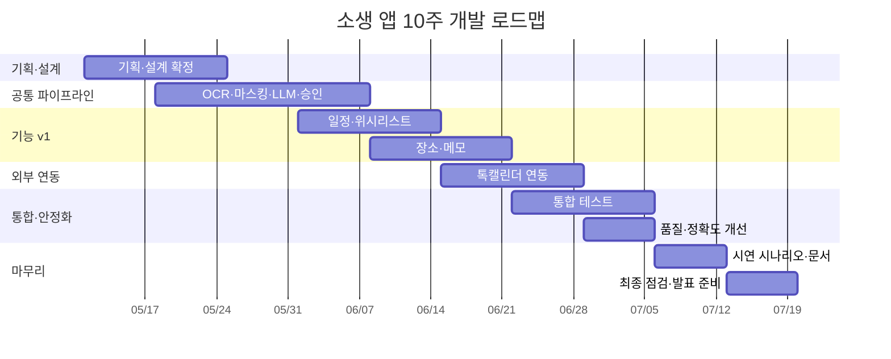

# 🚀 소생 앱 프로젝트 로드맵

> **프로젝트**: 사진 및 스크린샷 정보 추출 및 관리 "소생" 앱  
> **팀**: 스스슥 (부산대학교 정보컴퓨터공학부)  
> **기간**: 10주 (2026년 기준)  
> **전략**: 공통 파이프라인 완성 → 기능 v1 병렬 개발 → 통합 안정화 → 시연 준비

---

## 👥 팀원 역할 요약

| 팀원 | 역할 | 핵심 담당 |
|------|------|----------|
| **정채윤** | 팀장 / PM / ML Backend | 하이브리드 AI 파이프라인 설계, On-device AI 모델 구축·최적화, 개인정보 보호 레이어 |
| **오예린** | Backend / AI Infrastructure | LLM 기반 Structured Output, 검증 레이어, DB 설계·최적화, 외부 서비스 연동 |
| **공다은** | Mobile App / UI·UX / OCR | On-device OCR 엔진 통합, 비동기 데이터 처리 UI, 피드백 루프 UI, 로컬 스토리지 관리 |

---

## 📌 1주차 — 이것부터 시작하세요!

> [!IMPORTANT]
> 1주차는 프로젝트의 기반을 다지는 가장 중요한 주입니다. 여기서 기술 스택 확정과 환경 세팅이 완료되어야 2주차부터 개발에 착수할 수 있습니다.

### 🔵 정채윤 (PM / ML Backend)

| 우선순위 | 태스크 | 산출물 |
|---------|--------|--------|
| 🥇 | 전체 시스템 아키텍처 확정 (8단계 파이프라인 다이어그램 구체화) | 아키텍처 설계서 (다이어그램 포함) |
| 🥇 | 서버 환경 확정 (AWS / GCP / 학교 서버) 및 초기 세팅 | 서버 접속 정보 공유 |
| 🥈 | On-device AI 모델 후보 조사 (Scikit-learn vs TF Lite, 4대 카테고리 분류용) | 모델 후보 비교 문서 |
| 🥈 | 민감 정보 탐지 정규식 패턴 초안 설계 (주민번호, 카드번호, 쿠폰코드) | 정규식 패턴 목록 |
| 🥉 | 프로젝트 Git 저장소 생성, 브랜치 전략·커밋 컨벤션 확정 | README + CONTRIBUTING.md |
| 🥉 | 주간 회의 체계 확정 (회의 시간, 소통 채널, 이슈 트래커) | 팀 운영 규칙 문서 |

### 🟢 오예린 (Backend / AI Infra)

| 우선순위 | 태스크 | 산출물 |
|---------|--------|--------|
| 🥇 | FastAPI 프로젝트 초기 세팅 (프로젝트 구조, 의존성, 개발 환경 구성) | FastAPI 보일러플레이트 |
| 🥇 | OpenAI API 키 발급 및 테스트 호출 (GPT 모델 선택, 비용 추정) | API 연동 테스트 코드 + 비용 추정 문서 |
| 🥈 | LLM 응답 JSON 스키마 상세 설계 (4개 타입별 필드 정의) | JSON 스키마 명세서 |
| 🥈 | DB 스키마 초안 설계 (SQLite 테이블 구조 — 이미지 메타, 추출 결과, 사용자 승인 상태) | ERD 다이어그램 |
| 🥉 | 카카오톡 캘린더 REST API 문서 조사 및 연동 가능성 검토 | API 연동 검토 보고 |

### 🟡 공다은 (Mobile App / UI·UX / OCR)

| 우선순위 | 태스크 | 산출물 |
|---------|--------|--------|
| 🥇 | Flutter 프로젝트 초기 세팅 (폴더 구조, 상태 관리 패턴 결정, 라우팅) | Flutter 보일러플레이트 |
| 🥇 | On-device OCR 엔진 후보 조사 및 테스트 (Google ML Kit, Tesseract 등) | OCR 엔진 비교 테스트 결과 |
| 🥈 | 앱 주요 화면 와이어프레임/UI 목업 설계 (메인→업로드→초안카드→승인) | Figma 또는 목업 파일 |
| 🥈 | 로컬 저장소 폴더 구조 설계 구현 (AppStorage/SCHEDULE/PLACE/WISHLIST/MEMO) | 폴더 구조 코드 |
| 🥉 | 갤러리 이미지 선택 / 공유(Share) 수신 기능 프로토타입 | 이미지 업로드 데모 |

### ✅ 1주차 공통 마일스톤
- [ ] Git 저장소에 모든 팀원 초기 코드 커밋 완료
- [ ] 기술 스택 최종 확정 문서 작성
- [ ] 개발 환경 세팅 완료 (각자 로컬에서 빌드·실행 가능)

---

## 📅 2주차 — 기획·설계 마무리 + 파이프라인 착수

### 정채윤
- [ ] On-device AI 분류 모델 학습 데이터 수집 전략 확정 (스크린샷 샘플 카테고리별 수집)
- [ ] 민감 패턴 탐지 모듈 v1 구현 (정규식 기반 마스킹: `{MASKED_ID}`, `{MASKED_CARD}`)
- [ ] AI 파이프라인 인터페이스 설계 (OCR 텍스트 → 분류 → 마스킹 → 서버 전송 흐름)

### 오예린
- [ ] FastAPI 엔드포인트 설계 (텍스트 수신 → LLM 호출 → JSON 반환)
- [ ] LLM 프롬프트 엔지니어링 v1 (4개 타입 분류 + 필드 추출 프롬프트 작성)
- [ ] Structured Output / Function Calling 테스트 (JSON 스키마 강제 방식 검증)

### 공다은
- [ ] OCR 엔진 통합 구현 (선택한 엔진을 Flutter에 연동)
- [ ] 이미지 전처리 모듈 구현 (기울기 보정, 대비·명암 조정)
- [ ] 업로드 → OCR 결과 표시까지의 기본 흐름 UI 프로토타입

### ✅ 2주차 마일스톤
- [ ] 개별 모듈 단위 테스트 가능 상태
- [ ] 기획·설계 문서 최종 확정 (변경 사항 freeze)

---

## 📅 3주차 — 공통 파이프라인 통합 🎯 중간 데모

> [!TIP]
> **3주차 산출물**: 업로드 → OCR → 마스킹 → LLM → 사용자 승인 흐름의 End-to-End 데모

### 정채윤
- [ ] On-device AI 분류 모델 v1 학습 및 Flutter 통합 테스트
- [ ] 마스킹 모듈 ↔ 서버 전송 연동 테스트
- [ ] 전체 파이프라인 통합 테스트 리드

### 오예린
- [ ] LLM 구조화 API 완성 (4개 타입 모두 처리 가능)
- [ ] 검증 레이어 v1 구현 (필수 필드 누락 체크, 신뢰도 태깅)
- [ ] 서버 ↔ 앱 API 연동 테스트

### 공다은
- [ ] 초안 카드 UI 구현 (LLM 결과를 카드 형태로 표시)
- [ ] 사용자 승인/수정 폼 UI 구현
- [ ] 앱 ↔ 서버 API 통신 연결

### ✅ 3주차 마일스톤
- [ ] **🎯 공통 파이프라인 데모**: 이미지 1장 업로드 → 자동 분류 → 구조화 결과 표시 → 승인

---

## 📅 4~5주차 — 기능 v1 병렬 개발

> [!NOTE]
> 4개 기능을 2개씩 나누어 병렬 개발합니다.  
> - **4주차**: 일정 관리 + 위시리스트 (정채윤+오예린 중심)  
> - **5주차**: 장소 아카이빙 + 텍스트 메모화 (공다은+오예린 중심)

### 4주차

| 팀원 | 태스크 |
|------|--------|
| **정채윤** | SCHEDULE 타입 전용 분류 모델 튜닝, 만료일/시작일 정규화 로직 구현 |
| **오예린** | SCHEDULE/WISHLIST 타입 LLM 프롬프트 정밀 튜닝, DB CRUD 구현 |
| **공다은** | 일정 관리 화면 UI (캘린더 뷰, 알림 설정), 위시리스트 화면 UI (카테고리 태그, 가격 표시) |

### 5주차

| 팀원 | 태스크 |
|------|--------|
| **정채윤** | PLACE/MEMO 타입 분류 정확도 개선, 전체 4종 통합 분류 테스트 |
| **오예린** | PLACE/MEMO 타입 LLM 프롬프트 정밀 튜닝, 장소 검색/필터 API 구현 |
| **공다은** | 장소 아카이빙 화면 UI (지도/목록 뷰, 카테고리·지역 필터), 텍스트 메모 화면 UI |

### ✅ 5주차 마일스톤
- [ ] **🎯 4종 기능 v1 데모**: 타입별 추출 결과 및 저장 시연 가능

---

## 📅 6~7주차 — 외부 연동 + 통합 테스트

### 6주차

| 팀원 | 태스크 |
|------|--------|
| **정채윤** | 배치 처리 큐 & 우선순위 로직 구현 (폴더 업로드 대응), 이미지 해시 기반 캐시 구현 |
| **오예린** | 카카오톡 캘린더 REST API 연동 구현 (일정 등록, D-7/D-1 알림), 묶음 전송 최적화 |
| **공다은** | 폴더 업로드 UI 구현 (다중 이미지 선택, 초안 목록 표시), 원본 이미지 삭제 제안 UX (제안→동의→삭제) |

### 7주차

| 팀원 | 태스크 |
|------|--------|
| **정채윤** | 전체 파이프라인 End-to-End 통합 테스트, 엣지 케이스 처리 (OCR 실패, LLM 타임아웃) |
| **오예린** | 서버 보안 정책 구현 (텍스트 즉시 폐기, 로그 마스킹), 에러 핸들링 및 재시도 로직 |
| **공다은** | 처리 실패 시 대체 흐름 UI (재시도/수동 입력), 비동기 처리 상태 표시 (로딩/완료/실패) |

### ✅ 7주차 마일스톤
- [ ] **🎯 통합 앱 데모**: 톡캘린더 연동 + 삭제 제안 UX 포함 전체 시연

---

## 📅 8주차 — 품질·정확도 개선

| 팀원 | 태스크 |
|------|--------|
| **정채윤** | 분류 정확도 측정 및 개선 (목표: precision 0.85↑), 필드 추출 정확도 측정 (목표: 0.80↑) |
| **오예린** | LLM 프롬프트 최종 튜닝, 성능 테스트 (응답 시간 SLA 검증), 비용 최적화 |
| **공다은** | 사용자 승인률 측정을 위한 로깅 구현, UI/UX 피드백 반영 및 폴리싱 |

### 공통
- [ ] 성공 지표(KPI) 측정 실시
  - 분류 정확도 (precision ≥ 0.85)
  - 필드 추출 정확도 (≥ 0.80)
  - 초안 응답성 (1~3초)
  - 폴더 업로드 처리 (50장 → 5~10초)

---

## 📅 9주차 — 시연 시나리오 · 문서

| 팀원 | 태스크 |
|------|--------|
| **정채윤** | 최종 보고서 작성 (시스템 설계, 성과 지표 결과), 시연 시나리오 설계 |
| **오예린** | 서버 배포 안정화, API 문서 정리, 성능 측정 결과표 작성 |
| **공다은** | 시연용 데모 데이터 준비, 시연 시나리오별 앱 흐름 검증, 발표 자료 UI 스크린샷 |

### ✅ 9주차 마일스톤
- [ ] **🎯 성공 지표 측정 결과표** 완성
- [ ] **🎯 최종 시연 자료** 준비 완료

---

## 📅 10주차 — 최종 점검 · 발표 준비

| 팀원 | 태스크 |
|------|--------|
| **정채윤** | 최종 발표 리허설 진행, 질의응답 대비, 전체 문서 최종 검수 |
| **오예린** | 서버 최종 점검 (장애 대비), 라이브 데모 환경 준비 및 백업 시나리오 |
| **공다은** | 발표 자료(PPT) 최종 완성, 앱 최종 빌드 및 디바이스 테스트, 데모 리허설 |

### ✅ 10주차 마일스톤
- [ ] **🎯 최종 발표** 완료
- [ ] 모든 산출물 제출

---

## 🗺️ 전체 타임라인 요약

---

## ⚠️ 리스크 관리 체크포인트

| 시점 | 체크 항목 | 대응 방안 |
|------|----------|----------|
| 2주차 말 | OCR 엔진 성능이 기대 이하인가? | 대안 엔진 전환 (Google ML Kit ↔ Tesseract) |
| 3주차 말 | LLM 비용이 예산 초과 예상인가? | 묶음 전송, 프롬프트 압축, 모델 다운그레이드 |
| 5주차 말 | 분류 정확도가 0.70 미만인가? | 학습 데이터 확충, 프롬프트 재설계, 규칙 기반 보완 |
| 7주차 말 | 카카오 캘린더 API 연동 불가인가? | 구글 캘린더 대안 또는 앱 내 자체 알림 구현 |

---

> [!TIP]
> **1주차가 가장 중요합니다!** 기술 스택 확정, 개발 환경 세팅, API 테스트가 1주차에 끝나야 2주차부터 실질적인 개발이 가능합니다. 특히 **OCR 엔진 선택**과 **OpenAI API 테스트**는 전체 프로젝트의 핵심 의존성이므로 반드시 1주차에 검증하세요.
